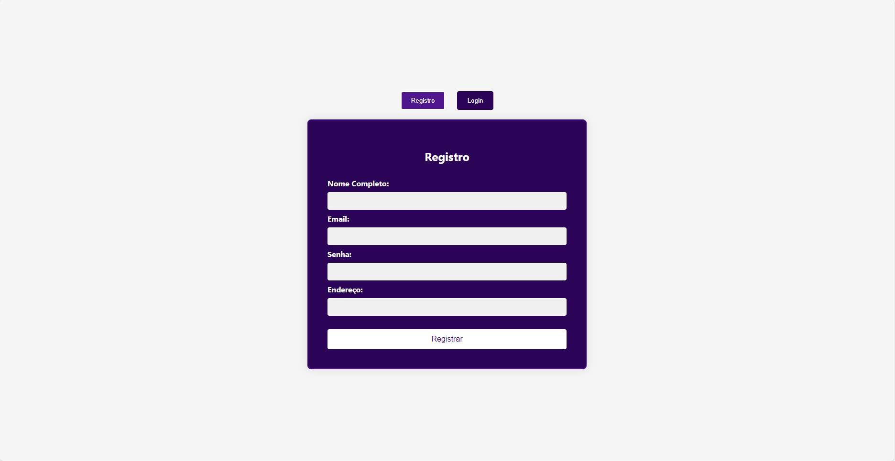

Com este trabalho, aprendi uma série de habilidades e conceitos importantes que são essenciais para o desenvolvimento web moderno. Aqui estão os principais pontos que absorvi durante o processo:

### Estruturação de Documentos HTML
Primeiramente, aprendi a criar a estrutura básica de um documento HTML, incluindo a definição de metadados no `<head>` e a construção do corpo do documento no `<body>`. Utilizei elementos HTML como `
`, `<button>`, `<h2>`, `<label>`, `<input>`, e `
` para construir formulários e exibir informações dinâmicas.

### Estilização com CSS
Entendi como aplicar estilos aos elementos HTML usando CSS. Isso incluiu:
- Utilizar seletores e classes para aplicar estilos específicos.
- Definir propriedades de estilo como `background-color`, `color`, `border`, `padding`, `margin`, e `border-radius` para melhorar a aparência dos componentes.
- Utilizar `flexbox` para centralizar e alinhar elementos na página, garantindo que o layout seja responsivo e visualmente agradável.
- Aplicar transições e efeitos de foco para melhorar a experiência do usuário.

### Manipulação de Eventos e DOM com JavaScript
Aprendi a manipular o Document Object Model (DOM) com JavaScript para criar uma experiência interativa. Isso envolveu:
- Utilizar `getElementById` e `querySelectorAll` para selecionar e manipular elementos HTML.
- Implementar funções JavaScript para alternar entre formulários de registro e login (`showForm`), registrar um usuário (`registerUser`), fazer login (`loginUser`), e realizar logout (`logout`).
- Adicionar e remover classes para modificar a aparência dos elementos de acordo com a interação do usuário.
- Utilizar `event.preventDefault()` para evitar o comportamento padrão dos formulários HTML.

### Integração de Arquivos CSS e JavaScript
Compreendi como estruturar e organizar meu projeto web, mantendo HTML, CSS e JavaScript em arquivos separados, mas interconectados. Isso melhora a manutenibilidade e a clareza do código.

### Experiência do Usuário e Design Responsivo
Ao aplicar bordas coloridas e centralizar o conteúdo, melhorei significativamente a experiência do usuário, criando um design mais atraente e intuitivo. Aprendi a importância de criar interfaces amigáveis e visualmente agradáveis que funcionam bem em diferentes dispositivos e tamanhos de tela.

### Compatibilidade com Ferramentas de Desenvolvimento
Familiarizei-me com a importância de garantir que meu código seja compatível com diferentes ferramentas de desenvolvimento, como Visual Studio, ajustando transições e outros efeitos conforme necessário.

### Conclusão
Este trabalho me proporcionou uma visão abrangente do processo de desenvolvimento web, desde a criação da estrutura HTML, passando pela estilização com CSS, até a interação dinâmica com JavaScript. Essas habilidades são fundamentais para qualquer desenvolvedor web e formam a base para projetos mais complexos no futuro. Agora, possuo uma compreensão sólida dos principais conceitos e práticas no desenvolvimento de aplicações web modernas.